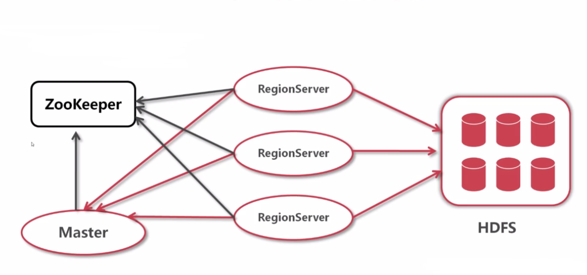
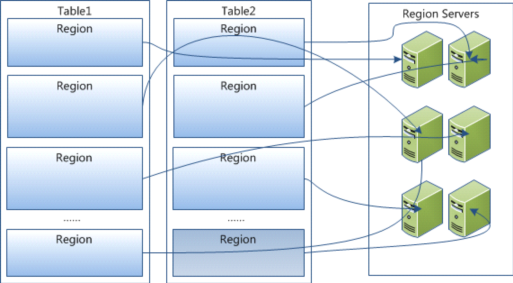
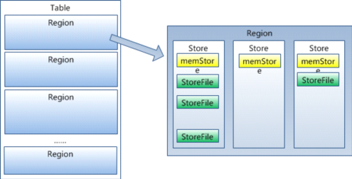

# Hbase简介
```
Hbase是Hadoop Database的简称 ，Hbase是分布式、面向列的开源数据库（其实准确的说是面向列族）。
HDFS为Hbase提供可靠的底层数据存储服务，MapReduce为Hbase提供高性能的计算能力，Zookeeper为Hbase提供稳定服务和Failover机制，因此我们说Hbase是一个通过大量廉价的机器解决海量数据的高速存储和读取的分布式数据库解决方案。
```

# HBase架构



# HBase数据模型

- 行健（Row Key）：表的主键，表中的记录默认按照行健升序排序

- 时间戳（Timestamp）：每次数据操作对应的时间戳，可以看作是数据的版本号

- 列族（Column Family）：表在水平方向有一个或者多个列族组成，一个列族中可以由任意多个列组成，列族支持动态扩展，无需预先定义列的数量以及类型，所有列均以二进制格式存储，用户需要自行进行类型转换。所有的列族成员的前缀是相同的，例如“abc:a1”和“abc:a2”两个列都属于abc这个列族。

- 表和区域（Table&Region）：当表随着记录数不断增加而变大后，会逐渐分裂成多份，成为区域，一个区域是对表的水平划分，不同的区域会被Master分配给相应的RegionServer进行管理

- 单元格（Cell）：表存储数据的单元。由{行健，列（列族:标签），时间戳}唯一确定，其中的数据是没有类型的，以二进制的形式存储。

# HBase物理存储
Table 在行的方向上分割为多个HRegion，每个HRegion分散在不同的RegionServer中。



每个HRegion由多个Store构成，每个Store由一个memStore和0或多个StoreFile组成，每个Store保存一个Columns Family。



# HBase存储数据的特点

- 和关系数据库一样，也是使用行和列的结构

- 建表时，定义的是表名和列族（字段的集合），而不是具体字段

- 列族中可以包含任意个字段，字段名不需要预定义，每一行中同一列族中的字段也可以不一致

- 多维结构，关系数据库的表是二维的，通过指行、列定位一个数据，HBase中需要通过 行健、列族名、字段名、版本号才能定位到具体数据

- 插入数据时，一次插入一个字段的数据，不是像关系数据库那样一次插入多个字段
