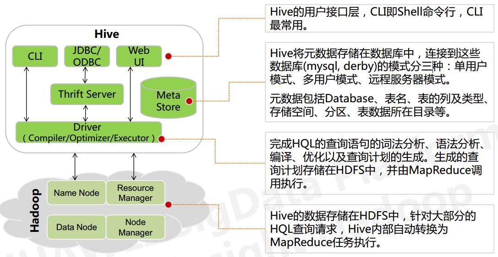

# Hive介绍
```
基于 Hadoop 的一个数据仓库工具：

hive本身不提供数据存储功能，使用HDFS做数据存储;

hive也不分布式计算框架，hive的核心工作就是把sql语句翻译成Map-Reduce任务;

hive也不提供资源调度系统，也是默认由Hadoop当中YARN集群来调度;

可以将结构化的数据映射为一张数据库表，并提供 HQL(Hive SQL)查询功能.
```

# Hive架构



# 元数据
元数据，通俗的讲，就是存储在 Hive 中的**数据的描述信息**。

Hive 中的元数据通常包括：表的名字，表的列和分区及其属性，表的属性（内部表和 外部表），表的数据所在目录。
