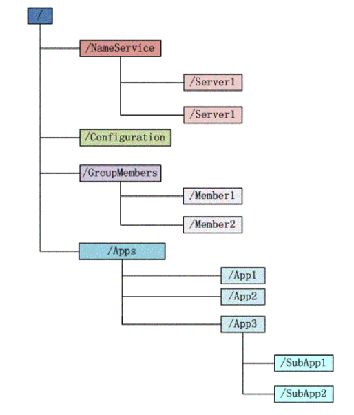
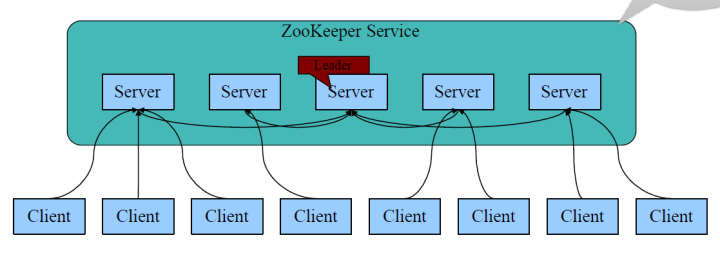
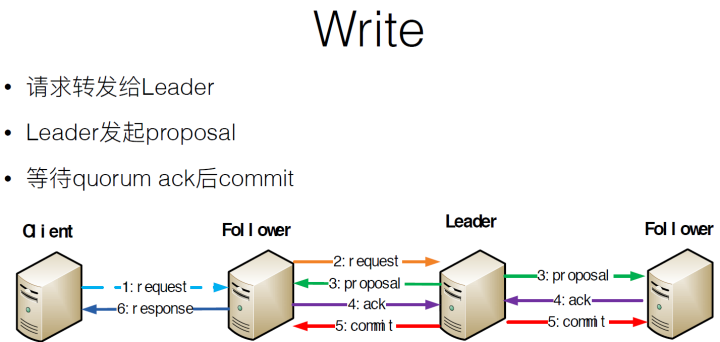
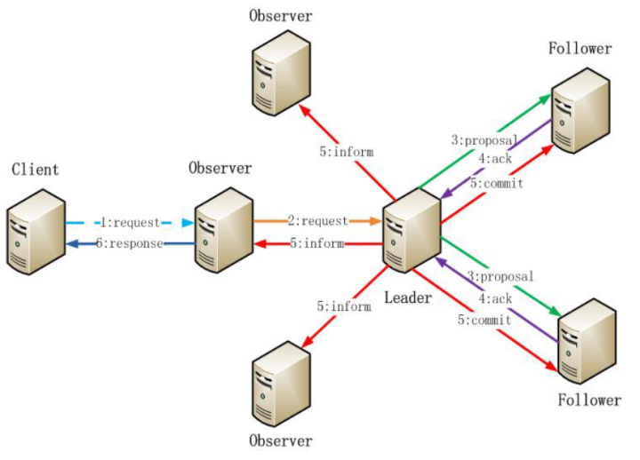
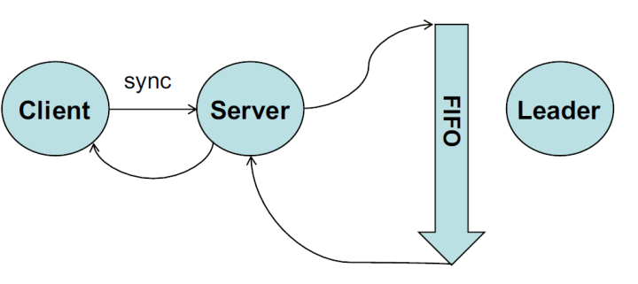

# Zookeeper 概述
zookeeper = 通知机制 + 文件系统。

## 通知机制

客户端注册监听它关心的目录节点，当目录节点发生变化，如数据改变、被删除、子目录节点增加删除时，zookeeper会通知客户端。 这时客户端就可以根据传过来的信息采取一系列的操作。

## 文件系统
zookeeper维护一个如下图的文件结构

1. 每个子目录项如 NameService 都被称作为 znode，有如下四种类型：

- PERSISTENT - 持久化目录节点：客户端与zookeeper断开连接后，该节点依旧存在

- PERSISTENT_SEQUENTIAL - 持久化顺序编号目录节点：客户端与zookeeper断开连接后，该节点依旧存在，只是Zookeeper给该节点名称进行顺序编号

- EPHEMERAL - 临时目录节点：客户端与zookeeper断开连接后，该节点被删除

- EPHEMERAL_SEQUENTIAL - 临时顺序编号目录节点：客户端与zookeeper断开连接后，该节点被删除，只是Zookeeper给该节点名称进行顺序编号

2. znode 可以有子节点目录 (临时节点除外)，并且每个 znode 可以存储数据zookeeper 的客户端和服务器通信采用长连接方式，每个客户端和服务器通过心跳来保持连接，这个连接状态称为 session，如果 znode 是临时节点，这个 session 失效时，znode 也就删除了znode可以被监控，实现上述通知机制

## Zookeeper功能
1. 统一命名服务：说白了，zookeeper会帮我们的文件起名，起的名字还挺好听，还不会重复，便于识别跟记忆，是不是很棒

2. 配置管理：简单点，改变一台机器的配置，其他机器也会跟着改变

3. 集群管理：监听是否有机器退出和加入、动态选举Master（最小节点法，最大数据法）

4. 队列管理：同步队列，当一个队列的成员都聚齐时，这个队列才可用，否则一直等待所有成员到达；队列按照 FIFO 方式进行入队和出队操作。

5. 实现分布式锁

# Zookeeper的基本概念
## 角色

1. 领导者（Leader）：进行投票的发起和决议，更新系统状态

2. 学习者（Learner）

- 跟随者（Follower）：接受客户端请求并向客户端返回结果，在选主过程中参与投票

- 观察者（Observer）：接收客户端的连接，将写请求转发给leader节点。但Observer不参加投票，只同步leader状态。Observer的目的是为了扩展系统，提高读取速度

3. 客户端（Client）：请求发起方

## session

zookeeper会为每个client分配一个session，类似于web服务器一样。针对session可以有保存一些关联数据：

- Global session 全局session，在每个server上都存在

- local session 只在当前请求的server上存在，但只能进行读操作，要是要进行写操作，就得升级为全局session

# Zookeeper的工作原理
1. zookeeper集群上每个server数据一致，leader在集群启动时选举，如图

2. 写操作时，请求发给某server，再由server转发给leader，leader给每个server发送投票消息，每个server把投票结果传给leader，要是有半数server同意此请求，leader就会commit到每个服务器执行写操作，流程如下：

3. 写操作流程中，observer角色只负责转发请求，不参与投票，如图：

4. 一个follower挂了，修复好之后会和leader通过一致性协议修复follower数据，达到每个server上数据最终一致

5. 存储数据时，过一段时间，zookeeper就会把所有server的数据镜像写出，然后把每个server上的数据删除，保证了每个server的容量

6. 在某一台follower写入了某数据的同时，读另一台follower刚刚写入的信息不一定成功，因为每台server数据同步会有少许间隔，所以说是最终一致性。不过session肯定是强一致性，通过修改数据后传回lastZxid来判断。若要实现强一致读，sync读两次实现实现，原理如下：

7. Watcher的特性：只通知改变事一次性、触发后失效、session内有效
