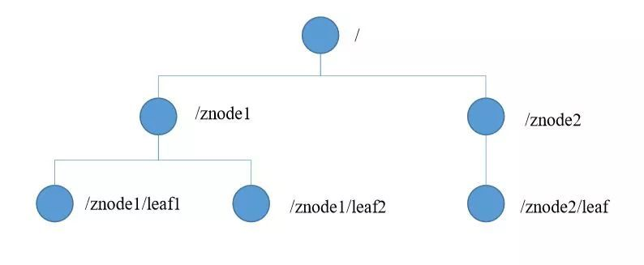
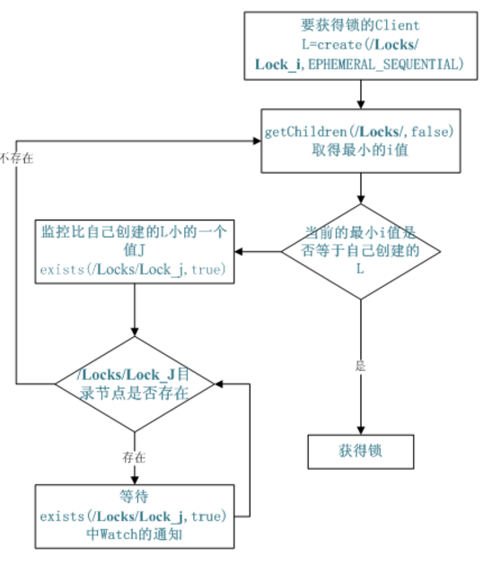

# Zookeeper分布式锁实现

要用Zookeeper实现分布式锁，就不得不提zookeeper的数据存储。首先zookeeper的核心保存结构是一个DataTree数据结构，其实内部是一个Map<String, DataNode> nodes的数据结构，其中key是path，DataNode才是真正保存数据的核心数据结构，DataNode核心字段包括byte data[]用于保存节点内容。

## Zookeeper的节点

节点是zookeeper（zk）中数据存储的基础结构，zk中万物皆节点，就好比Java中万物皆对象一样。zk的数据模型就是基于节点的树形结构，但zk规定每个节点的引用规则是路径引用。每个节点中包含子节点引用、存储数据、访问权限以及节点元数据等四部分。

zookeeper中提供了节点类型主要有：

- 持久节点：节点创建后，就一直存在，直到有删除操作来主动清除。
- 顺序节点：假如当前有一个父节点为/lock，我们可以在这个父节点下面创建子节点；zk提供了一个可选的有序特性，例如我们可以创建子节点“/lock/test_”并且指明有序，那么zk在生成子节点时会根据当前子节点数量自动添加整数序号，如果第一个子节点为/lock/test_0000000000，下一个节点则为/lock/test_0000000001，依次类推。
- 临时节点：客户端可以建立一个临时节点，在会话结束或者会话超时后，zookeeper会自动删除该节点。

## Zookeeper分布式锁实现

Zookeeper实现分布式锁的流程，假设锁空间的根节点为/zklock：

1. 客户端连接zookeeper，并在/zklock下创建临时的且有序的子节点。第一个客户端对应的子节点为：/zklock/test_lock_0000000000，第二个为：/zklock/test_lock_0000000001。以此类推。

2. 客户端获取/zklock下的子节点列表，判断自己创建的子节点是否为当前子节点列表中序号最小的子节点，如果是则认为获得锁，否则监听/zklock的子节点变更消息，获得子节点变更通知后重复此步骤直至获得锁;

3. 执行业务代码。

4. 完成业务流程后，删除对应的子节点并释放锁。

## Curator分布式锁实现

Curator就是Netflix开源的一套ZooKeeper客户端框架，它提供了zk场景的绝大部分实现，使用Curator就不必关心其内部算法，Curator提供了来实现分布式锁，用方法获取锁，以及用方法释放锁，同其他锁一样，方法需要放在finally代码块中，确保锁能正确释放。

Curator提供了四种分布式锁，分别是：

- InterProcessMutex：分布式可重入排它锁
- InterProcessSemaphoreMutex：分布式排它锁
- InterProcessReadWriteLock：分布式读写锁
- InterProcessMultiLock：将多个锁作为单个实体管理的容器
