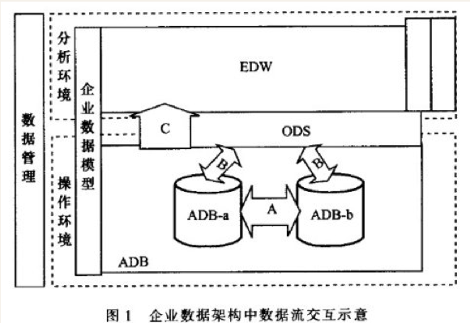

**数据仓库(Data Warehouse)：是一个面向主题的（Subject Oriented）、集成的（Integrated）、相对稳定的（Non-Volatile）、反映历史变化（Time Variant）的数据集合，用于支持管理决策(Decision Making Support)。**

# 数据库(DB)与数据仓库(DW)的区别与联系

数据库：传统的关系型数据库的主要应用，主要是基本的、日常的事务处理，例如银行交易。

数据仓库：数据仓库系统的主要应用主要是OLAP（On-Line Analytical Processing），支持复杂的分析操作，侧重决策支持，并且提供直观易懂的查询结果。

## OLTP和OLAP概念补充

数据处理大致可以分成两大类：联机事务处理OLTP（on-line transaction processing）、联机分析处理OLAP（On-Line Analytical Processing）。

OLTP是传统的关系型数据库的主要应用，主要是基本的、日常的事务处理，例如银行交易。
OLAP是数据仓库系统的主要应用，支持复杂的分析操作，侧重决策支持，并且提供直观易懂的查询结果。

OLTP 系统强调数据库内存效率，强调内存各种指标的命令率，强调绑定变量，强调并发操作；
OLAP 系统则强调数据分析，强调SQL执行市场，强调磁盘I/O，强调分区等。 

## 例子

举个最常见的例子，拿电商行业来说好了。

基本每家电商公司都会经历，从只需要业务数据库到要数据仓库的阶段。

第一阶段，电商早期启动非常容易，入行门槛低。找个外包团队，做了一个可以下单的网页前端 + 几台服务器 + 一个MySQL，就能开门迎客了。这好比手工作坊时期。

第二阶段，流量来了，客户和订单都多起来了，普通查询已经有压力了，这个时候就需要升级架构变成多台服务器和多个业务数据库（量大+分库分表），这个阶段的业务数字和指标还可以勉强从业务数据库里查询。初步进入工业化。

第三阶段，一般需要 3-5 年左右的时间，随着业务指数级的增长，数据量的会陡增，公司角色也开始多了起来，开始有了 CEO、CMO、CIO，大家需要面临的问题越来越复杂，越来越深入。高管们关心的问题，从最初非常粗放的：“昨天的收入是多少”、“上个月的 PV、UV 是多少”，逐渐演化到非常精细化和具体的用户的集群分析，特定用户在某种使用场景中，例如“20~30岁女性用户在过去五年的第一季度化妆品类商品的购买行为与公司进行的促销活动方案之间的关系”。

这类非常具体，且能够对公司决策起到关键性作用的问题，基本很难从业务数据库从调取出来。原因在于：

1. 业务数据库中的数据结构是为了完成交易而设计的，不是为了而查询和分析的便利设计的。

2. 业务数据库大多是读写优化的，即要读（查看商品信息），也要写（产生订单，完成支付）。因此对于大量数据的读（查询指标，一般是复杂的只读类型查询）是支持不足的。

而怎么解决这个问题，此时我们就需要建立一个数据仓库了，公司也算开始进入信息化阶段了。数据仓库的作用在于：

1. 数据结构为了分析和查询的便利；

2. 只读优化的数据库，即不需要它写入速度多么快，只要做大量数据的复杂查询的速度足够快就行了。

**那么在这里前一种业务数据库（读写都优化）的是业务性数据库，后一种是分析性数据库，即数据仓库。**

## 常见产品

- 数据库比较流行的有：MySQL,Oracle,SqlServer,DB2等

- 数据仓库比较流行的有：AWS Redshift,Greenplum,Hive等

# 操作数据存储(ODS)与数据仓库(DW)的区别与联系
## 基础概念

数据仓库(Data Warehouse)：是一个面向主题的（Subject Oriented）、集成的（Integrated）、相对稳定的（Non-Volatile）、反映历史变化（Time Variant）的数据集合，用于支持管理决策(Decision Making Support)。

操作数据存储(ODS)：是一个面向主题的、集成的、可变的、当前的细节数据集合，用于支持企业对于即时性的、操作性的、集成的全体信息的需求。

ODS是数据仓库体系结构中的一个可选部分，**是DB与DW之间的中间层**，ODS具备数据仓库的部分特征和OLTP系统的部分特征。

## ODS的工作过程

生产系统中的运营数据通过ETL（抽取、转换、装载）过程进人到ODS中，生产系统之间准实时的数据交换由ODS系统完成，ODS系统同时还将整合好的生产系统下的运营数据通过ETL等方式传送到EDW中，完成运营数据从操作环境进人到分析环境的过程。

**ODS是EDW的一个有益的补充和扩展。**

## 两者相同点

- ODS与EDW都是企业数据架构中的独立系统，两个系统都不是直接产生运营数据的系统，两个系统中的数据都是由操作环境的数据经过抽取、转换、加载(ETL)的过程而来，还要进行进一步的清理、整合等工作(EDW的数据可由ODS加载装入)。

- ODS与EDW一样都既有细粒度的数据。也有根据不同维度汇总的汇总数据。

- ODS与EDW上均提供基于跨系统整合后数据的报表类应用。

## 两者不同点

1. **使用角色**

- ODS主要面向营业、渠道等一线生产人员和一线管理人员，为了实现准实时、跨系统的运营细节数据的查询，以获得细粒度的运营数据展现，例如渠道人员查询客户的全视图信息由ODS提供数据支撑。

- EDW主要面向专业分析人员、辅助决策支持人员等，为了实现基于历史数据的统计分析和数据挖掘，以获得客户深层次的特征和市场发展的规律，例如专业分析人员的经营状况趋势分析由EDW提 供支撑。

2. **数据来源**

- ODS需要的大部分运营数据直接来源生产系统。 ODS中的部分分析结果数据来源于EDW，例如客户 洞察信息等。

- EDW需要的运营数据，如果在ODS中已存在，EDW则直接从ODS获取这部分数据。EDW需要的运营数据，如果在ODS中没有，EDW则直接从生产系统获取这部分数据。

3. **数据获取性能和及时性**

- ODS支持OLTP类型的数据更新，数据更新时间短，数据可实现准实时更新，性能与及时性都高于EDW 。

- EDW中的数据一般通过批量加载进入，数据更新速度慢，无法实现准实时更新，数据更新时间不足以支持实时的报表和事件监控需求。

4. **数据架构**

- ODS以关注生产运营过程的统计与监控为主的生产视角主题域方式来组织数据。ODS提供操作数据的统计，主要提供应用需要的细粒度运营数据。ODS中也存在部分粗粒度汇总数据，但汇总的维度少且简单。

- EDW关注对历史数据的深层次分析与挖掘．从分析与挖掘的需要出发按不同主题维度来汇总与组织数据。EDW提供历史数据的展示和分析，主要提供多层粗粒度汇总数据．汇总的维度多且复杂。

5. **数据共享能力**

- ODS为其他生产系统提供运营数据的准实时数据共享服务。

- EDW一般不为生产系统提供此类准实时的数据共享服务。系统中的数据只供本系统分析与挖掘应用使用。

6. **系统提供应用数据查询**

- ODS提供生产环境下的数据查询，查询的交易量较小，不耗费太多资源，有确定的完成速度。而EDW提供分析环境下的查询，查询单元量较大，消耗的资源很多，完成的速度也不确定。

- ODS提供生产环境下实时性较高的生产经营报表，动态报表。而EDW提供分析环境下的主题分析与挖掘报表，固态报表。

- ODS提供面向少量维度的细粒度数据的统计，而EDW提供面向多个维度的多层粗粒度数据的主题统计、分析及深层次的挖掘。

- ODS提供绩效管理和统计、数据质量审计和监控管理等功能。 EDW提供趋势分析、客户消费行为分析和评估等功能。

7. **数据存储**

- 客户等关键实体数据：ODS长久保存当前数据，EDW长久保存当前与历史数据。

- 详单数据：ODS保存1个月到3个月；EDW保存2年。

- 汇总数据：ODS保存3年；EDW保存5年。

- 其他数据：ODS保存13个月；EDW保存3年。

8. **系统技术特征**

- ODS主要面对大并发用户数、小数据量的访问，EDW主要面对小并发用户数、大数据量的访问。

- ODS数据库优化同时侧重索引和分区技术；EDW数据库优化主要侧重分区技术。

- ODS支持OLTP类型和OLAP(联机分析处理)类型的数据操作，EDW支持OLAP类型的数据操作。

9. **系统可靠性**

- ODS参与运营．必须保证可靠性。

- 相对ODS，EDW可以允许有更多的脱机时间。

10. **系统开放性**

- 因为需要与大量不同硬件、数据库配置的系统相互交换数据。ODS要求比较高的系统开放性。

- EDW一般只获取数据，而不提供给其他应用系统以多种模式直接访问，解决方案上也可采用相对封闭的数据库、软硬件平台。

# ETL概念补充

ETL是数据抽取（Extract）、清洗（Cleaning）、转换（Transform）、装载（Load）的过程。是构建数据仓库的重要一环，用户从数据源抽取出所需的数据，经过数据清洗,最终按照预先定义好的数据仓库模型，将数据加载到数据仓库中去。
